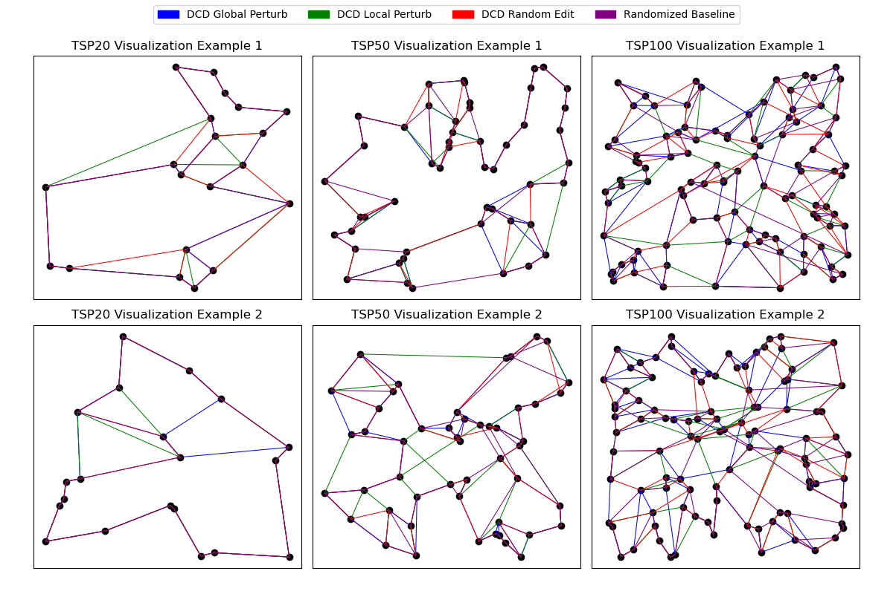

# Dual Curriculum TSP

This repository contains code for an adapted version of ACCEL, an algorithm based on dual curriculum design, for solving the Traveling Salesman Problem. We work off of the codebase for the [Attention, Learn to Solve Routing Problems!](https://openreview.net/forum?id=ByxBFsRqYm) paper, which uses an attention-based model trained with REINFORCE on a greedy rollout baseline.


Models trained with different curriculums do end up learning different paths!




## Environment Setup

To install dependencies with `conda`, run the following to create an environment named `dcd_tsp`:

```
conda env create --file environment.yml
```

Don't forget to activate the environment:

```
conda activate dcd_tsp
```

Alternatively, dependencies can be installed manually:
* [Python](https://www.python.org/) >= 3.10
* [NumPy](https://numpy.org/)
* [SciPy](https://scipy.org/)
* [PyTorch](https://pytorch.org/) >= 2.1
    * PyTorch Cuda >= 11.8 if necessary
* [tqdm](https://tqdm.github.io/)
* [tensorboard_logger](https://github.com/TeamHG-Memex/tensorboard_logger)
* [Matplotlib](https://matplotlib.org/)

To work with the Concorde solver, which we treat as an oracle, run the following command. Note that only `concorde_baseline.py` uses Concorde; the rest of the code still runs smoothly even if Concorde is not installed. We've found success installing Concorde on Linux but not Windows.

```
pip install "pyconcorde @ git+https://github.com/jvkersch/pyconcorde"
```

## Usage

### Generating Data

Training data is generated on the fly. To generate validation and test data (same as used in the paper) for the TSP:
```
python generate_data.py --problem tsp --name validation --seed 1234
python generate_data.py --problem tsp --name test --seed 1234
```

### Training

For training TSP instances using rollout as a REINFORCE baseline:
```
python run.py --problem tsp --graph_size <NODE-COUNT> --baseline rollout --edit_fn <EDIT-FUNCTION> --epoch_size <EPOCH-SIZE> --batch_size <BATCH-SIZE> --n_epochs <EPOCH-COUNT> --checkpoint_epochs <CHECKPOINT-FREQUENCY> --run_name <NAME>
```

Example usage:
```
python run.py --problem tsp --graph_size 100 --baseline rollout --edit_fn global_perturb --epoch_size 4096 --batch_size 128 --n_epochs 100 --checkpoint_epochs 10 --run_name tsp100_dcd_global
```

Note that if `edit_fn` is omitted, all training data is generated randomly on the fly and there is no curriculum learning in play.

#### Multiple GPUs
By default, training will happen *on all available GPUs*. To disable CUDA at all, add the flag `--no_cuda`. 
Set the environment variable `CUDA_VISIBLE_DEVICES` to only use specific GPUs:
```
CUDA_VISIBLE_DEVICES=2,3 python run.py 
```
Note that using multiple GPUs has limited efficiency for small problem sizes (up to 50 nodes).

#### Warm start
You can initialize a run using a pretrained model by using the `--load_path` option:
```
python run.py --graph_size 100 --load_path pretrained/tsp_100/epoch-99.pt
```

The `--load_path` option can also be used to load an earlier run, in which case also the optimizer state will be loaded:
```
python run.py --graph_size 20 --load_path 'outputs/tsp_20/tsp20_rollout_{datetime}/epoch-0.pt'
```

The `--resume` option can be used instead of the `--load_path` option, which will try to resume the run, e.g. load additionally the baseline state, set the current epoch/step counter and set the random number generator state.

### Evaluation

For evaluating a model (by default the last epoch in the folder is used if no epoch is specified):
```
python eval.py <DATA-FILE> --model <MODEL-FILE> --decode_strategy greedy --eval_batch_size <BATCH-SIZE>
```

Example usage:
```
python eval.py data/tsp/tsp_unif100_test_seed1234.pkl --model outputs/tsp_100/tsp100_dcd_global --decode_strategy greedy --eval_batch_size 128
```

Example using a specific epoch and saving to a specific result name (note that setting `--width 0` is necessary for using `-o`):
```
python eval.py data/tsp/tsp_unif100_test_seed1234.pkl --model outputs/tsp_100/tsp100_default/epoch-50.pt -o results/tsp/tsp20_test_seed1234_epochs/tsp100_default_epoch-50.pkl --width 0 --decode_strategy greedy --eval_batch_size 128
```

To use a "oracle baseline" for computing gap, add the following flag:

```
--oracle_baseline <BASELINE-FILE>
```

Running `concorde_baseline.py` can create such a baseline file; note that `pyconcorde` needs to have been correctly installed to run without error:

```
python concorde_baseline.py --data_path <DATA-FILE>
```

#### Sampling
To report the best of 1280 sampled solutions, use
```
python eval.py data/tsp/tsp_unif20_test_seed1234.pkl --model pretrained/tsp_20 --decode_strategy sample --width 1280 --eval_batch_size 1
```
Beam Search can be used using `--decode_strategy bs --width <BEAM-SIZE>`.

#### Baselines
Baselines for different problems are within the corresponding folders and can be ran (on multiple datasets at once) as follows
```
python -m problems.tsp.tsp_baseline farthest_insertion data/tsp/tsp_unif20_test_seed1234.pkl data/tsp/tsp_unif50_test_seed1234.pkl data/tsp/tsp_unif100_test_seed1234.pkl
```
To run baselines, you need to install [Compass](https://github.com/bcamath-ds/compass) by running the `install_compass.sh` script from within the `problems/op` directory and [Concorde](http://www.math.uwaterloo.ca/tsp/concorde.html) using the `install_concorde.sh` script from within `problems/tsp`. [LKH3](http://akira.ruc.dk/~keld/research/LKH-3/) should be automatically downloaded and installed when required. To use [Gurobi](http://www.gurobi.com), obtain a ([free academic](http://www.gurobi.com/registration/academic-license-reg)) license and follow the [installation instructions](https://www.gurobi.com/documentation/8.1/quickstart_windows/installing_the_anaconda_py.html).

### Help

To view valid command syntax:
```
python run.py -h
python eval.py -h
```
